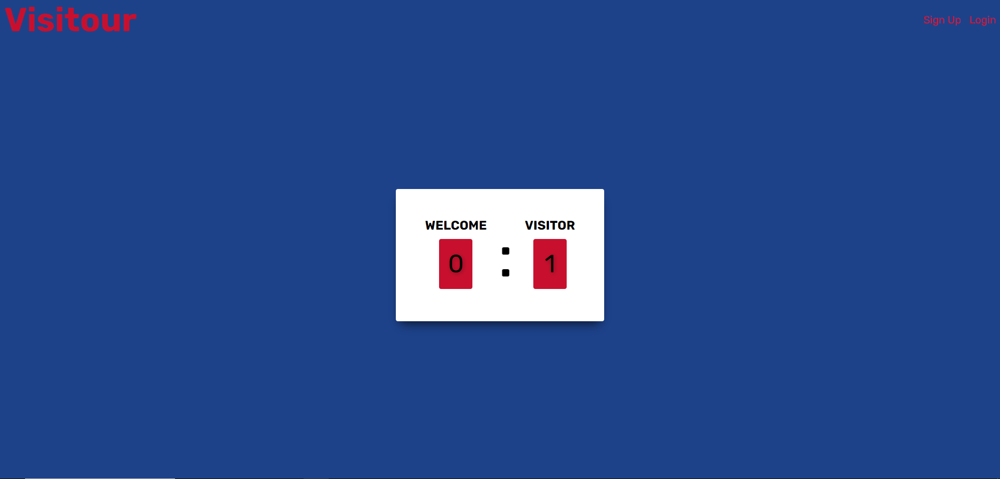
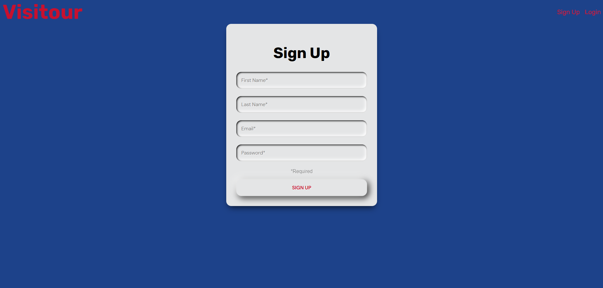
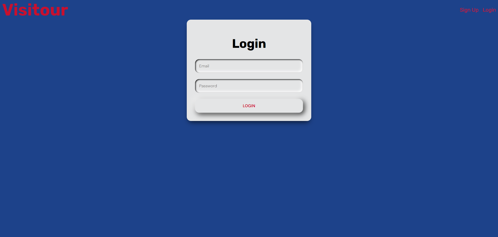
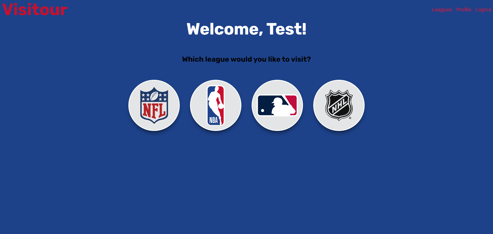
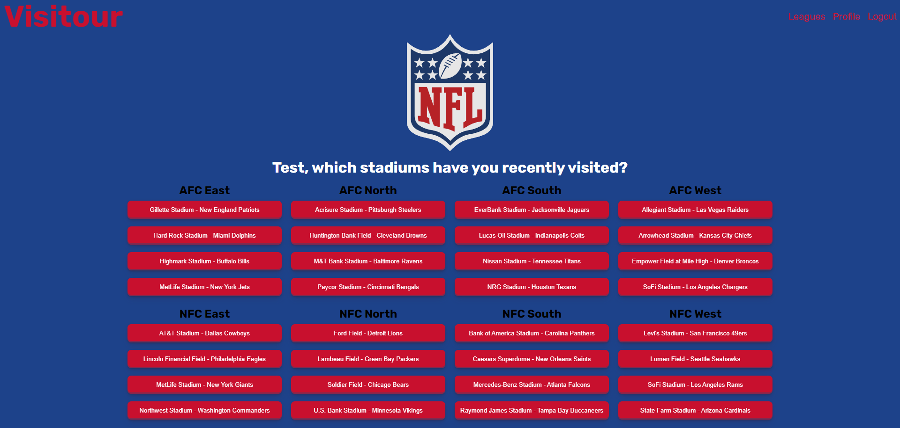
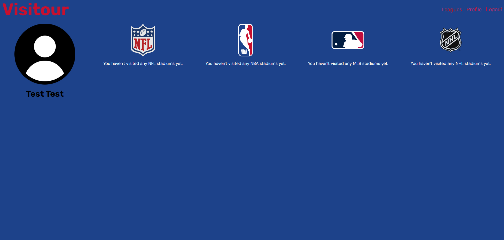

# VISITOUR

## Description

Welcome to Visitour, visitor! Visitour was designed to allow users to track which sports stadiums they have visited amongst various sports leagues, mainly the National Football League (NFL), National Basketball Association (NBA), Major League Baseball (MLB), and National Hockey League (NHL). 

Some victories I experienced throughout development includes: 
- Getting my queries and mutations up and running quickly
- Desiging a front-end that is very user-friendly 
- Being agile and fluid with the design to create a user-friendly experience on my app

Some challenges I experienced throughout development include:
- Managing/updating the state of the buttons to properly render whether a user has visited a stadium or not
- Making sure I cover as many edge cases as I possibly could in order to provide the best user experience
- Manipulating the data to properly render the data

## Table of Contents

  [Images](#images)

  [Installation](#installation)

  [Credits](#credits)
  
  [Frequently Asked Questions (FAQ)](#FAQ)
  
  [License](#license)

  [Contact](#contact)

## Images 

Home Page: 
Sign Up: 
Login: 
Welcome: 
Sample League Page (NFL): 
Profile Page: 

## Installation 

The following installations were used:

Back-end:

    "dependencies": {
        "@apollo/server": "^4.7.1",
        "apollo-server": "^3.13.0",
        "bcrypt": "^5.0.0",
        "express": "^4.17.2",
        "graphql": "^16.6.0",
        "jsonwebtoken": "^8.5.1",
        "mongoose": "^8.0.0",
        "stack": "^0.1.0"
    },
    "devDependencies": {
        "nodemon": "^2.0.3"
    }

Front-end:

  "dependencies": {
    "@apollo/client": "^3.7.14",
    "graphql": "^16.6.0",
    "jwt-decode": "^3.1.2",
    "react": "^18.3.1",
    "react-calendar": "^5.0.0",
    "react-dom": "^18.3.1",
    "react-router-dom": "^6.26.2"
  },
  "devDependencies": {
    "@eslint/js": "^9.9.0",
    "@types/react": "^18.3.3",
    "@types/react-dom": "^18.3.0",
    "@vitejs/plugin-react": "^4.3.1",
    "eslint": "^9.9.0",
    "eslint-plugin-react": "^7.35.0",
    "eslint-plugin-react-hooks": "^5.1.0-rc.0",
    "eslint-plugin-react-refresh": "^0.4.9",
    "globals": "^15.9.0",
    "vite": "^5.4.1"
  }

## Credits

Credits include: 

- Header link hover from: https://codepen.io/team/css-tricks/pen/xxPOgmZ
- Home screen buttons from: https://codepen.io/konradwax/pen/woPNqJ
- Login and signup form from: https://codepen.io/swapnet/pen/QWwPVwE
- Welcome page icons from: https://codepen.io/ephs23/pen/NeQZGx
- Eye and plus icon button hover on league page from: https://codepen.io/foxeisen/pen/bqZxLa (Effect 3)
- Button design on leagues and profile page from: https://getcssscan.com/css-buttons-examples (Button 29)

## Frequently Asked Questions (FAQ)

1. How was your app created?

Visitour was created using a MERN stack. MongoDB for the database, Express.js to manager servers, React for front-end design, and Node.js to execute the server side.

2. What was your inspiration behind creating the app?

The inspiration behind this project was from a trip where I went and visited 4 Major League Baseball stadiums in 5 days, and while I was able to create and save a lot of memories from that trip, I want to be able to track and log these visits in an app! One day, I want to be able to visit all 30 Major League Baseball Stadiums!

3. Are there any future developments for the app?

Yes! There are many future developments that the app can undertake.

Short-term developments include: 
- Users will be able to read about the stadium (where it is located, the history behind the stadium - when it was built, etc.)
- A counter that will update the amount of stadiums they have visited per league
- Adding notes or comments to document their experiences at the stadium
- Email functionality so users can receive emails during account creation process
- Password reset functionality

Long-term developments include: 
- Creation of AI to help guide users on recommendations for visits based on the user's patterns
- Tracking the number of times a person has visited a stadium
- Tracking the number of visitors a stadium receives
- Adding photos to document a visit
- Rating their experiences

## License

This project uses the MIT license.

## Contact

To find my other work, you can visit me at:

https://github.com/dcho10

To contact me, you can contact me at: davidceee10@gmail.com